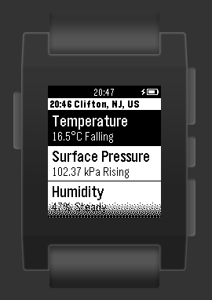

# pebblejs-watchapp-cirrus

Copyright © 2015 Wayne D Grant
W
Licensed under the MIT License

PebbleJS Watch App to display [Weather Display Live](http://www.weather-display.com/wdlive.php) data.

## Overview

pebblejs-watchapp-cirrus is a PebbleJS based Watch App that displays data exposed by exposed by a [json-webservice-wdlive](https://github.com/waynedgrant/json-webservice-wdlive) web service.

pebblejs-watchapp-cirrus supports the display of various weather items in either metric or imperial measurement units.

## Weather Items

### Temperature
Celsius (°C) or Fahrenheit (°F)
* Current Temperature with Trend
* Daily High
* Daily Low

### Surface Pressure
Hectopsacals (hPa) or Inches of Mercury (inHg)
* Current Surface Pressure with Trend
* Daily High
* Daily Low

### Humidity
Percentage (%)
* Current Humidity with Trend
* Daily High
* Daily Low

### RainFall
Millimetres (mm) or Inches (in)
* Daily Rainfall
* Current Rate
* Max Rate
* Yesterday's Rainfall

### Wind
Kilometres per Hour (km/h) or Miles per Hour (mph) and Cardinal Direction
* Average Wind Speed
* Wind Direction
* Gust Speed
* Max Gust Speed
